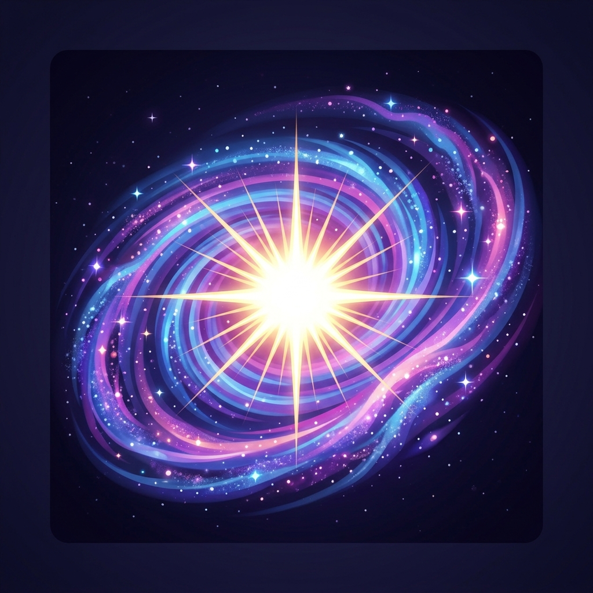

<p align="center">
  
</p>

<h1 align="center">Nova AI</h1>

<p align="center">
  <strong>Personal AI Operating System — Local-First, Privacy-First</strong>
</p>

<p align="center">
  <a href="https://nov-assistant.com">Website</a> •
  <a href="https://nov-assistant.com/site/download.html">Download</a> •
  <a href="https://nov-assistant.com/site/features.html">Features</a> •
  <a href="https://nov-assistant.com/site/pricing.html">Pricing</a>
</p>

<p align="center">
  
  
  
  
</p>

---

Nova is a personal AI operating system that runs locally on your machine. It combines a beautiful web interface with a powerful desktop app featuring 8 AI agents, 12 built-in skills, semantic memory, a CLI, and a scheduler — all powered by local LLMs through Ollama.

## ✨ Features

### Web App ([nov-assistant.com](https://nov-assistant.com))
- **21 free AI models** — Llama, Gemma, Qwen, DeepSeek, Mistral & more
- **Multi-provider fallback** — Groq, OpenRouter, SambaNova
- **Streaming chat** with markdown, code highlighting, and copy buttons
- **Image generation** — create visuals with AI
- **Google OAuth** — sign in to sync chats across devices
- **Cosmic UI** — glassmorphism, animations, dark theme

### Desktop App (macOS)
Everything in the web app, plus:

| Feature | Description |
|---------|-------------|
| **8 AI Agents** | Simple, Orchestrator, Research, ReAct, Code, Monitor, Operative, Digest |
| **12 Skills** | Web search, file ops, shell exec, calculator, timer, weather + GitHub plugin install |
| **Memory System** | Local embeddings, semantic search, file/directory indexing |
| **Scheduler** | Cron-like recurring agent jobs with run history |
| **CLI** | `nova` command with 20+ subcommands |
| **Bundled Ollama** | Offline AI built in — no cloud required |
| **Native TTS** | macOS `say` for voice output |
| **System Tray** | Quick access to agents, skills, memory |

### Agent Types

| Agent | Type | What it does |
|-------|------|-------------|
| Simple | On-demand | Direct LLM chat, no tools |
| Orchestrator | On-demand | Breaks tasks into subtasks, delegates to other agents |
| Research | On-demand | Multi-hop research with web search and citations |
| ReAct | On-demand | Thought → Action → Observation reasoning loop |
| Code | On-demand | Generates and executes Python/JS in a sandbox |
| Monitor | Continuous | Watches metrics on a schedule, alerts on anomalies |
| Digest | Scheduled | Daily briefing from weather, system info, and more |
| Operative | On-demand | Stealth agent for sensitive local operations |

### Built-in Skills

| Skill | Category |
|-------|----------|
| Web Search (DuckDuckGo) | Search |
| Read/Write/List/Info Files | File System |
| Shell Execute | System |
| Calculator | Utility |
| Timer/Alarm | Utility |
| Weather/Forecast | Information |

## 🚀 Quick Start

### Web App
Visit [nov-assistant.com](https://nov-assistant.com) — no install needed.

### Desktop App (macOS)
```bash
# Download the .dmg from GitHub Releases
open "https://github.com/escipionpedroza147-commits/Nova/releases/latest"
```

Or download directly from [nov-assistant.com/site/download.html](https://nov-assistant.com/site/download.html).

### CLI
After installing the desktop app:
```bash
nova help          # Show all commands
nova ask "question" # Quick one-shot question
nova research "topic" # Deep research with citations
nova code "task"    # Generate and execute code
nova doctor         # Check system health
nova memory stats   # Memory system info
nova skills list    # Show installed skills
nova agents list    # Show available agents
```

## 🏗 Architecture

```
Nova/
├── src/web/           # Web frontend + backend
│   ├── static/        # Single-page app (index.html)
│   └── api.py         # FastAPI backend
├── desktop/           # Electron desktop app
│   ├── main.js        # Electron main process
│   ├── agents/        # 8 agent types
│   ├── skills/        # 12 built-in skills + plugin system
│   ├── memory/        # Embeddings + semantic search
│   ├── scheduler/     # Cron-like job system
│   ├── cli/           # nova CLI (20+ commands)
│   └── ui/            # Desktop-only pages
├── src/               # Original Python assistant
└── website/           # Assets
```

### Tech Stack
- **Frontend**: Single HTML file, vanilla JS, CSS glassmorphism
- **Backend**: Python FastAPI, SSE streaming, SQLite, Google OAuth
- **Desktop**: Electron, Node.js, bundled Ollama
- **AI**: Ollama (local), OpenRouter, Groq, SambaNova (cloud fallback)
- **Hosting**: GCP e2-micro, nginx, Let's Encrypt

## 📋 System Requirements

| Requirement | Minimum |
|-------------|---------|
| OS | macOS 12+ (Monterey) |
| CPU | Apple Silicon (M1/M2/M3/M4) |
| RAM | 4 GB |
| Disk | ~500 MB + model storage |

## 🔒 Privacy

- All agent, skill, and memory features run **100% locally**
- Cloud models are optional (for the web app)
- No telemetry, no tracking
- Your data stays on your machine

## 📄 License

MIT — see [LICENSE](LICENSE) for details.

## 👤 Author

**Escipion Pedroza** — [@escipionpedroza147-commits](https://github.com/escipionpedroza147-commits)

- Website: [nov-assistant.com](https://nov-assistant.com)
- Ko-fi: [ko-fi.com/escipion17](https://ko-fi.com/escipion17)
